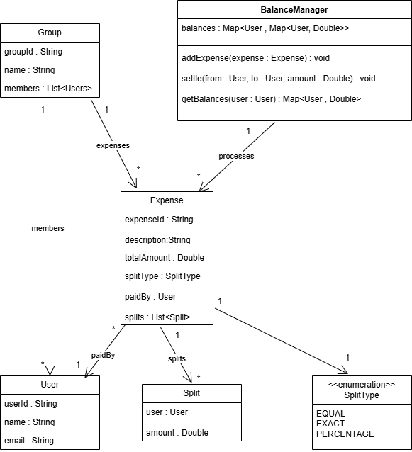

# expense-sharing-app
This document describes the low-level design of a simplified expense sharing application similar to Splitwise.
The system allows users to create groups, add shared expenses with different split types, track balances, and settle dues.

## Objective
Design a backend system that supports:
-	Creating users and groups
-	Adding shared expenses
-	Tracking balances (who owes whom)
-	Settling dues
-	Simplifying balances

## Requirements

- Users can create and manage groups
- Users can add shared expenses within a group
- The system supports the following split types:
  - Equal split
  - Exact amount split
  - Percentage split
- Each user can view:
  - The total amount they owe
  - The total amount owed to them
- Balances should be automatically simplified to minimize the number of settlements

## Core Entities
- User
- Group
- Expense
- Split
- BalanceManager
  
## Class Diagram

## Entity Design

### User
- userId : String
- name : String
- email : String

### Group
- groupId : String
- name : String
- members : List<User>

### Expense
- expenseId : String
- description : String 
- totalAmount : Double
- paidBy : User
- splitType : SplitType
- splits : List<Split>

### Split
- user : User
- amount : Double

### BalanceManager
- balances : Map<User, Map<User, Double>>
- addExpense(expense : Expense)
- getBalances(user : User)
- settle(from : User, to : User, amount : Double)

## Balance Tracking
The system tracks net dues between users using a bidirectional balance map.

### Data Structure - 

           Map<User, Map<User, Double>> balances

### Interpretation -

          balances[A][B] = X

- X > 0 → User B owes A amount X
- X < 0 → User A owes B amount |X|
- X = 0 → No dues between users
  
This structure represents both payables and receivables clearly.

## Split Types

1. Equal Split - 
Total amount is divided equally among all users.

2. Exact Split - 
Sum of all split amounts must be equal to the total expense amount.

3. Percentage Split - 
Sum of all percentages must be 100.

Each user’s share is calculated accordingly.

## Expense Addition Flow
1. Expense is created
2. Expense is split based on split type
3. Payer is credited
4. Other users are debited
5. Balances are updated

## Balance Simplification

### Objective 
Minimize the number of settlement transactions while preserving net balances.

### Simplification Steps

1. Compute net balance for each user:
   
       netBalance[user] = sum(balances[user][*])
   
- netBalance > 0 → user should receive money
- netBalance < 0 → user needs to pay money

2. Divide users into:
    - Creditors
    - Debtors

3. Match debtors to creditors greedily:
    -  Settle minimum possible amount
    -  Reduce both balances
    -  Continue until all balances become zero

## Settlement
When a user settles dues, the balance between users
is reduced and marked as settled.

## Conclusion
This design provides a clean and extensible low-level
design for an expense sharing application with simplified balances.

